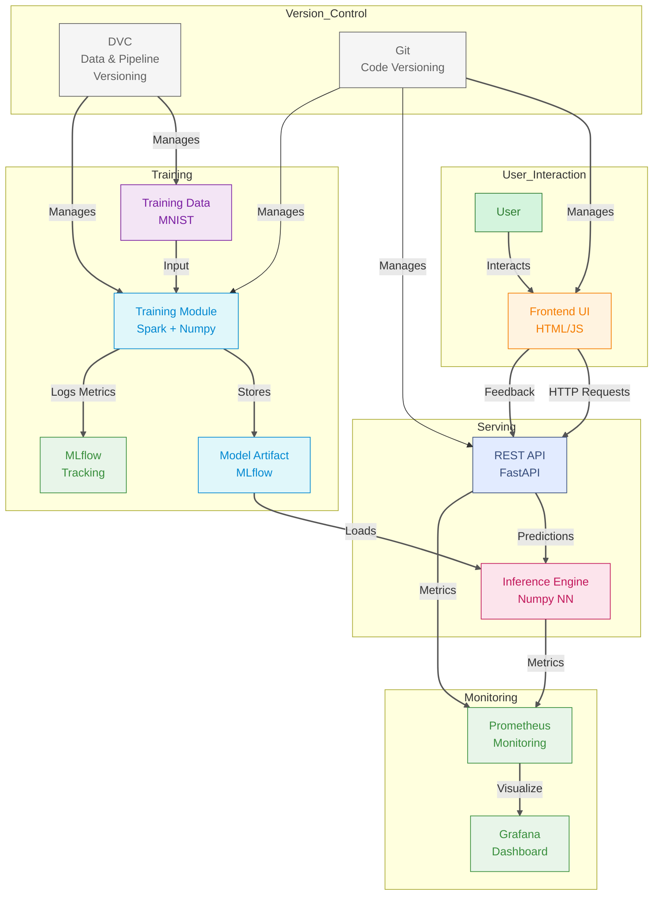

I'm excited to guide you through my **Doodle Digit Classifier** project, built from scratch with raw **Numpy** to predict digits doodled on a web canvas. Inspired by the idea of understanding through creation, . Let's explore this system-spanning training, serving, and monitoring-with a concise, first-person perspective, focusing on the intricate monitoring API and project details.

---

### My Vision: Decoding Doodles with Numpy
I set out to recognize handwritten digits (0-9) using a neural network crafted solely with **Numpy**, avoiding high-level frameworks. This project, hosted at [aayushmanda/FastAPI](https://github.com/aayushmanda/FastAPI), is my deep dive into the math of ML-matrix operations, gradients, and all-transforming a pixelated sketch into a number through hands-on coding.

---

### System Architecture: My Computational Graph
I’ve structured this into four domains: **Training**, **Serving**, **Monitoring**, and **Version Control**. Here’s how they connect.

#### 1. Training: Crafting the Neural Net
- **Data Prep with Spark**: I use **PySpark** to ingest the MNIST dataset (70k images) from binary files into arrays via RDDs and DataFrames. Spark’s scalability is overkill for MNIST, but it preps me for larger datasets.
- **Numpy Model**: My custom multi-layer perceptron, built with **Numpy**, handles forward and backward passes manually. It’s raw and revealing-pure math in action.
- **MLflow Tracking**: I log every run with **MLflow** (`mlflow.set_experiment("MNIST_Digit_Classification")`), capturing hyperparameters, accuracy metrics, and artifacts like `metrics.json` in `mlruns/`.

#### 2. Serving: From Sketch to Prediction
- **Frontend (HTML/JS)**: At `http://localhost:3000`, my web canvas lets users draw digits, sending 784-pixel vectors to the backend for prediction and feedback.
- **Backend (FastAPI)**: My **FastAPI** server at `http://localhost:7000` processes `/predict/` requests with the trained model and logs feedback via `/feedback/`.
- **Inference Engine**: The loaded Numpy model (`model_save_test.pkl`) computes predictions, a direct application of my trained weights.

#### 3. Monitoring: Deep Insights with APIs
- **Prometheus Metrics API**: I’ve wired **Prometheus** to track every API call, data drift (input anomalies), and feedback errors via `/metrics`. My custom counters (`data_drift_detected_total`, `prediction_error_total`) expose real-time health signals, scraped every second for analysis.
- **Grafana Visualization**: Connected to Prometheus, my **Grafana** dashboards at `http://localhost:3001` plot trends-API usage, error spikes, drift patterns-offering visual diagnostics without log diving.
- **Feedback Logging API**: The `/feedback/` endpoint logs user inputs (predicted vs. actual digits) to `feedback_log.json`, incrementing error counts in `inference_metrics.json` if predictions miss. This API fuels my monitoring by capturing real-world performance, vital for spotting model weaknesses.
- **Metrics Storage**: I persist metrics in JSON files (`inference_metrics.json`), ensuring historical data for manual analysis or custom dashboard extensions, enhancing my monitoring depth.

#### 4. Version Control: Reproducibility Anchors
- **DVC**: I use **DVC** to version MNIST data and pipeline stages (`dvc.yaml`), ensuring reproducible workflows with `dvc repro`.
- **Git**: My **Git** repo tracks code changes across frontend, backend, and training scripts, enabling collaboration and history.

---

### My Workflow: DVC Pipeline
I’ve defined a **DVC Pipeline** in `dvc.yaml` to orchestrate this system:
- **Preprocess**: Downloads MNIST data.
- **Train**: Builds the Numpy model, logs to MLflow.
- **Serve**: Runs FastAPI for predictions.
- **Test**: Validates API with requests.
- **Kill Server**: Stops the server post-test.

The DAG below maps this flow, a clear dependency graph I rely on for execution.

```
dvc dag
+------------+   
| preprocess |   
+------------+   
        *        
        *        
        *        
   +-------+     
   | train |     
   +-------+     
        *        
        *        
        *        
   +-------+     
   | serve |     
   +-------+     
        *        
        *        
        *        
    +------+     
    | test |     
    +------+     
        *        
        *        
        *        
+-------------+  
| kill_server |  
+-------------+       
```

---

### Why I Built This
I wanted to master ML fundamentals by coding a neural net with **Numpy**, understanding every operation. **Spark** taught me data scaling, **MLflow** experiment tracking, **FastAPI** API design, **Prometheus/Grafana** monitoring, and **DVC/Git** reproducibility. It’s my learning lab.

---

### User Guide: Doodle Digit Predictor
I’ve made it easy for anyone to test my app at `http://localhost:3000/index.html`:
1. **Draw**: Sketch a digit (0-9) on the canvas.
2. **Predict**: Click "Predict Digit" for results.
3. **Feedback**: Enter the actual digit if wrong, click "Submit Feedback."
4. **Reset**: "Clear Canvas" to start over.
**Tips**: Draw clearly. Errors? Check server status with your admin.

---


### My Vision: Decoding Doodles with Numpy
I set out to recognize handwritten digits (0-9) using a neural network crafted solely with **Numpy**, avoiding high-level frameworks. This project, hosted at [aayushmanda/FastAPI](https://github.com/aayushmanda/FastAPI), is my deep dive into the math of ML-matrix operations, gradients, and all-transforming a pixelated sketch into a number through hands-on coding.

---

### System Architecture: My Computational Graph
I’ve structured this into four domains: **Training**, **Serving**, **Monitoring**, and **Version Control**. Here’s how they connect.

#### 1. Training: Crafting the Neural Net
- **Data Prep with Spark**: I use **PySpark** to ingest the MNIST dataset (70k images) from binary files into arrays via RDDs and DataFrames. Spark’s scalability is overkill for MNIST, but it preps me for larger datasets.
- **Numpy Model**: My custom multi-layer perceptron, built with **Numpy**, handles forward and backward passes manually. It’s raw and revealing-pure math in action.
- **MLflow Tracking**: I log every run with **MLflow** (`mlflow.set_experiment("MNIST_Digit_Classification")`), capturing hyperparameters, accuracy metrics, and artifacts like `metrics.json` in `mlruns/`.

#### 2. Serving: From Sketch to Prediction
- **Frontend (HTML/JS)**: At `http://localhost:3000`, my web canvas lets users draw digits, sending 784-pixel vectors to the backend for prediction and feedback.
- **Backend (FastAPI)**: My **FastAPI** server at `http://localhost:7000` processes `/predict/` requests with the trained model and logs feedback via `/feedback/`.
- **Inference Engine**: The loaded Numpy model (`model_save_test.pkl`) computes predictions, a direct application of my trained weights.

#### 3. Monitoring: Deep Insights with APIs
- **Prometheus Metrics API**: I’ve wired **Prometheus** to track every API call, data drift (input anomalies), and feedback errors via `/metrics`. My custom counters (`data_drift_detected_total`, `prediction_error_total`) expose real-time health signals, scraped every second for analysis.
- **Grafana Visualization**: Connected to Prometheus, my **Grafana** dashboards at `http://localhost:3001` plot trends-API usage, error spikes, drift patterns-offering visual diagnostics without log diving.
- **Feedback Logging API**: The `/feedback/` endpoint logs user inputs (predicted vs. actual digits) to `feedback_log.json`, incrementing error counts in `inference_metrics.json` if predictions miss. This API fuels my monitoring by capturing real-world performance, vital for spotting model weaknesses.
- **Metrics Storage**: I persist metrics in JSON files (`inference_metrics.json`), ensuring historical data for manual analysis or custom dashboard extensions, enhancing my monitoring depth.

#### 4. Version Control: Reproducibility Anchors
- **DVC**: I use **DVC** to version MNIST data and pipeline stages (`dvc.yaml`), ensuring reproducible workflows with `dvc repro`.
- **Git**: My **Git** repo tracks code changes across frontend, backend, and training scripts, enabling collaboration and history.

---

### My Workflow: DVC Pipeline
I’ve defined a **DVC Pipeline** in `dvc.yaml` to orchestrate this system:
- **Preprocess**: Downloads MNIST data.
- **Train**: Builds the Numpy model, logs to MLflow.
- **Serve**: Runs FastAPI for predictions.
- **Test**: Validates API with requests.
- **Kill Server**: Stops the server post-test.

The DAG below maps this flow, a clear dependency graph I rely on for execution.

```
dvc dag
+------------+   
| preprocess |   
+------------+   
        *        
        *        
        *        
   +-------+     
   | train |     
   +-------+     
        *        
        *        
        *        
   +-------+     
   | serve |     
   +-------+     
        *        
        *        
        *        
    +------+     
    | test |     
    +------+     
        *        
        *        
        *        
+-------------+  
| kill_server |  
+-------------+       
```

---

### Why I Built This
I wanted to master ML fundamentals by coding a neural net with **Numpy**, understanding every operation. **Spark** taught me data scaling, **MLflow** experiment tracking, **FastAPI** API design, **Prometheus/Grafana** monitoring, and **DVC/Git** reproducibility. It’s my learning lab.

---

### User Guide: Doodle Digit Predictor
I’ve made it easy for anyone to test my app at `http://localhost:3000/index.html`:
1. **Draw**: Sketch a digit (0-9) on the canvas.
2. **Predict**: Click "Predict Digit" for results.
3. **Feedback**: Enter the actual digit if wrong, click "Submit Feedback."
4. **Reset**: "Clear Canvas" to start over.
**Tips**: Draw clearly. Errors? Check server status with your admin.


---

### Next Steps
I plan to set a DVC remote (e.g., S3), enhance UI with confidence scores.

---


# Data Engineering [Spark used]

- **Data Ingestion / Transformation**:  
  I used **PySpark** (`SparkSession`) to load and preprocess the **MNIST images and labels**:
  - Images and labels are read from binary files using Python's `struct` and `numpy`.
  - The data is parallelized into **RDDs** and then converted into **Spark DataFrames** with explicit schemas (`StructType`).
  - This prepares the MNIST dataset in a distributed way, though the dataset is relatively small.

- **Throughput and Speed**:  
  Since MNIST is a lightweight dataset, Spark isn't fully utilized for scalability here. However, using Spark **shows readiness for scaling to bigger datasets** and **makes ingestion structured and parallelizable**.

- **Presence of Airflow/Spark/Custom pipeline**:  
  I am using **Spark** as the **data engineering pipeline** (✔️).

---

# Source Control & Continuous Integration [DVC and Git, GitHub Action]

I'm excited to dive into the **Source Control & Continuous Integration** aspects of my **Handwritten Digit Classifier** project, built from the ground up with **Numpy** to predict digits drawn on a web canvas. Let's explore how I’ve integrated **DVC**, **Git**, and **GitHub Actions** into my MLOps pipeline to ensure versioning, reproducibility, and automation, Karpathy-style, with a focus on clarity and depth.

---

## Source Control & Continuous Integration: My Backbone for Reproducibility
In building this project, I’ve prioritized a robust system for managing code, data, and workflows to ensure every experiment and deployment is reproducible and collaborative. My approach leverages **Git** for code versioning, **DVC** for data and pipeline management, and **GitHub Actions** for continuous integration (CI). Here’s how these tools form the foundation of my MLOps setup.

#### 1. Git: Versioning My Codebase
- **Purpose**: I use **Git** to track every change in my source code across the frontend (HTML/JS), backend (FastAPI), and training scripts (Numpy/Spark). It’s my history log, ensuring I can roll back to any point if a bug creeps in or collaborate with others seamlessly.
- **Implementation**: My project is hosted in a Git repository ([aayushmanda/FastAPI](https://github.com/aayushmanda/FastAPI)), where I commit updates to scripts like `fast.py`, `train.py`, and UI files. Commands like `git add .` and `git commit -m "Update prediction logic"` keep my codebase versioned.
- **Benefit**: Git provides a safety net for my development process, allowing me to experiment with new features (e.g., feedback logic in `fast.py`) without fear of losing stable versions. It also ties into my CI pipeline via GitHub.

#### 2. DVC: Managing Data and Pipelines
- **Purpose**: I rely on **DVC (Data Version Control)** to version large datasets (like MNIST) and manage my pipeline stages, ensuring reproducibility of data processing and training workflows. Unlike Git, DVC is optimized for handling big files and ML artifacts.
- **Implementation**: My `dvc.yaml` defines stages-`preprocess`, `train`, `serve`, `test`, and `kill_server`-tracking dependencies (e.g., `mnist/`, `model_save_test.pkl`) and outputs (e.g., `metrics.json`, `server.log`). I use `dvc add mnist/` to version data and `dvc repro` to rerun the pipeline consistently.
- **Benefit**: DVC ensures that my data and model artifacts are tied to specific pipeline versions, so I can recreate any experiment exactly. It’s integrated with Git (e.g., `git add mnist.dvc`) to link data metadata with code commits.

#### 3. GitHub Actions: Automating CI/CD
- **Purpose**: I’ve set up **GitHub Actions** for continuous integration (CI) to automate testing and deployment workflows whenever I push changes to my repository. This keeps my project in a deployable state by catching issues early.
- **Implementation**: I’ve configured a workflow file (e.g., `.github/workflows/ci.yml`) in my GitHub repo to trigger on `push` or `pull_request` events. It runs steps like:
  - Checking out the code (`actions/checkout@v3`).
  - Setting up Python and dependencies (`actions/setup-python@v4`).
  - Installing DVC and pulling data (`dvc pull`).
  - Executing `dvc repro` to rerun my pipeline (preprocess, train, test).
  - Running tests via `test_api.py` to validate API endpoints (`/predict/`, `/feedback/`).
  - Optionally deploying updates if tests pass (e.g., pushing artifacts to a remote).
- **Benefit**: GitHub Actions automates validation of my code and pipeline, ensuring that every commit or PR is tested against the full workflow. It saves me from manual checks and integrates with DVC to handle data-driven CI, aligning with MLOps best practices.

---

### Why This Trio Matters
I chose **Git**, **DVC**, and **GitHub Actions** because they form a seamless MLOps backbone. Git versions my code, DVC handles data and pipeline reproducibility, and GitHub Actions automates testing and integration. Together, they ensure that my project-from training with MNIST to serving predictions via FastAPI-remains consistent, trackable, and deployable. This setup lets me focus on building (like crafting my Numpy neural net) while the system manages the grunt work of versioning and validation.

---

### Integration in My Workflow
- **Daily Development**: I commit code changes with Git (`git commit`), version data/models with DVC (`dvc add`), and push to GitHub (`git push`), triggering CI via GitHub Actions.
- **Pipeline Execution**: My `dvc.yaml` stages (`train`, `serve`, etc.) are rerun automatically in CI or manually with `dvc repro`, ensuring data and code sync.
- **Collaboration**: GitHub hosts my repo, where PRs trigger GitHub Actions to test changes, maintaining quality for team contributions.


# Experiment Tracking [MLflow used properly]

- **Experiment Tracking with MLflow** following has been implemented:
  - **Experiment** is set with `mlflow.set_experiment("MNIST_Digit_Classification")`.
  - **Tracking URI** is set to local filesystem (`file:./mlruns`).
  - **run** (`with mlflow.start_run`) and **log parameters** (hyperparameters like learning rate, epochs, etc).
  -  **log metrics** (train and test accuracy).
  - Also **log artifacts manually** (you save a `metrics.json`, commented out logging artifacts though — needs `mlflow.log_artifact("metrics.json")` to activate).
  - **set tags** to describe model type and dataset — beyond default autologging (✔️).

- **Tracked Items**:
  - **Parameters**: learning rate, number of epochs, batch sizes, layer sizes, output size.
  - **Metrics**: train accuracy, test accuracy.
  - **Artifacts** (partially): metrics.json (model file is saved, but not yet logged to MLflow).
  - **Tags**: model type ("Custom Neural Network"), dataset ("MNIST").


---


# 📄 Updated DVC Pipeline (your `dvc.yaml`)
**Stages you have defined:**

| Stage Name          | Command | Key Actions |
|---------------------|---------|-------------|
| `preprocess`         | `python download_mnist.py` | Download MNIST data (saved into `mnist/`). |
| `train`              | `python train.py` | Train the model ➔ Output model `model_save_test.pkl` and `metrics.json`. |
| `serve`              | `nohup python fast.py > server.log 2>&1 &` | Start FastAPI server in background. |
| `test`               | `python test_api.py` | Test the FastAPI server by sending a request. Output: `test_result.json`. |
| `kill all process`   | `pkill uvicorn || true` | Kill Uvicorn server process after testing. |

---

# Key Updates and Notes:
- ✅ **Model versioning** is handled (`model_save_test.pkl` as `outs` in DVC).
- ✅ **Metrics tracking** is done (`metrics.json` tracked inside DVC).
- ✅ **Artifacts** like `server.log` and `test_result.json` are managed.


---


# ⚡ Final small TODOs
- `dvc remote` is not configured (like GDrive, S3, etc.)

---

<!-- https://github.com/user-attachments/assets/39132ce1-bf7e-4020-86cf-b6afc05fa541 -->

``


# Doodle Digit Predictor User Manual

This guide helps non-technical users draw and predict digits using the web application.

## Getting Started
- **URL**: `http://localhost:3000/index.html`
- **Requirements**: A web browser (Chrome or Firefox recommended).


# High-Level Design (HLD) Diagram
My HLD diagram maps user interaction to prediction, training, monitoring, and version control-a visual of my system’s data flow. (See the Mermaid flowchart in prior content.)




      
# 🧠 Summary: Your Updated MLOps Architecture
| Component | Tool | Status |
|-----------|------|--------|
| Data Ingestion | Spark | ✔️ |
| Model Training | Custom NN + MLflow tracking | ✔️ |
| Experiment Tracking | MLflow | ✔️ |
| Version Control | Git + DVC | ✔️  |
| Pipeline Automation | GitHub Actions (CI) | ✔️  |
| Model Serving | FastAPI | ✔️ |
| Model Testing | API-based tests | ✔️ |

---


