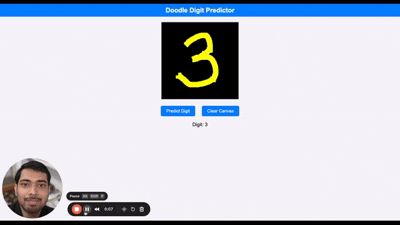

# Hand Written Digit Classifier Numpy Only
The Handwritten Digit Classifier is a project developed to classify digits drawn by the user in an interface. The training and calculations of the algorithm were implemented using only the Numpy library. The main objective of this project is to gain an in-depth understanding of how a neural network functions. It aims to provide insights into the underlying mechanics of neural networks without relying on high-level libraries, focusing instead on core concepts like forward propagation, backpropagation, and gradient descent.

Richard Feynman: What I cannot create, I do not understand.

<!-- https://github.com/user-attachments/assets/39132ce1-bf7e-4020-86cf-b6afc05fa541 -->

## How to Play
To start the canvas, execute the `app.py` file.<br>
Draw a number between 0 and 9 and press the "Tell the Number" button.<br>
If you want to start over, press the "Erase" button.<br>

<div align="center">
  
</div>
 

  https://drive.google.com/file/d/1G5a0BTOJifjhFvBnBCGxYmZYy2xrx3Tk/view?usp=sharing

# Doodle Digit Predictor User Manual

This guide helps non-technical users draw and predict digits using the web application.

## Getting Started
- **URL**: `http://localhost:3000/index.html`
- **Requirements**: A web browser (Chrome or Firefox recommended).

## How to Use
1. **Draw a Digit**:
   - Use your mouse to draw a digit (0–9) on the black canvas.
   - Click and drag to draw with a yellow brush.
2. **Predict the Digit**:
   - Click the "Predict Digit" button.
   - The predicted digit will appear below the canvas (e.g., "Digit: 5").
3. **Clear the Canvas**:
   - Click the "Clear Canvas" button to erase your drawing and start over.
4. **View Errors**:
   - If prediction fails, an error message will appear in red (e.g., "Connection Failed").

## Tips
- Draw clearly and fill the canvas for accurate predictions.
- Ensure the backend server is running (contact your administrator if errors occur).

## Troubleshooting
- **Canvas Not Responding**: Try a different browser or refresh the page.
- **Prediction Fails**: Check your internet connection or contact the administrator.
- **Error Messages**: Read the red text below the canvas for details.

<!-- ## Screenshot
[Insert screenshot of the canvas with a drawn digit and result] -->


```bash
dvc init
git add .dvc .gitignore
git commit -m "Initialize DVC"

dvc add mnist/
git add mnist.dvc
git commit -m "Track MNIST dataset"
```


```
dvc dag
+------------+ 
| preprocess | 
+------------+ 
       *       
       *       
       *       
  +-------+    
  | train |    
  +-------+    
       *       
       *       
       *       
  +-------+    
  | serve |    
  +-------+    
       *       
       *       
       *       
   +------+    
   | test |    
   +------+    
       *       
       *       
       *       
    +-----+    
    | end |    
    +-----+   
```

```
scrape_configs:
  - job_name: "fastapi-app"
    scrape_interval: 1s
    static_configs:
      - targets: ["localhost:7000"]


  - job_name: "custom_exporter"
    scrape_interval: 5s
    static_configs:
      - targets: ["localhost:18000"]


  - job_name: "prometheus"
    static_configs:
      - targets: ["localhost:9090"]
```

from fastapi import FastAPI, HTTPException
from fastapi.middleware.cors import CORSMiddleware
import uvicorn
from pydantic import BaseModel
import numpy as np
import os
import pickle
import logging
import argparse
import json
from utils import *
from dense_neural_class import *
from prometheus_fastapi_instrumentator import Instrumentator
from prometheus_client import Counter, REGISTRY

# Set up logging to debug issues in Codespaces
logging.basicConfig(level=logging.INFO)
logger = logging.getLogger(__name__)

app = FastAPI(title="Predict Digits")

# Allow all origins for debugging in Codespaces
app.add_middleware(
    CORSMiddleware,
    allow_origins=["*"],
    allow_credentials=True,
    allow_methods=["*"],
    allow_headers=["*"],
    expose_headers=["*"]
)

# Configurable port number
parser = argparse.ArgumentParser()
parser.add_argument("--port", type=int, default=7000)
args = parser.parse_args()
port = args.port

# Initialize Prometheus instrumentation
instrumentator = Instrumentator()
instrumentator.instrument(app).expose(app, endpoint="/metrics")

# Custom Prometheus metrics (explicitly registered)
data_drift_counter = Counter(
    'data_drift_detected_total',
    'Total number of data drift detections',
    registry=REGISTRY
)
api_call_counter = Counter(
    'api_predict_calls_total',
    'Total number of calls to the predict endpoint',
    registry=REGISTRY
)

def load_model(filename):
    current_dir = os.path.dirname(os.path.abspath(__file__))
    filepath = os.path.join(current_dir, filename)
    try:
        with open(filepath, 'rb') as file:
            model_loaded = pickle.load(file)
        logger.info(f"Model loaded successfully from {filepath}")
        return model_loaded
    except FileNotFoundError:
        logger.error(f"Model file {filepath} not found")
        raise
    except Exception as e:
        logger.error(f"Error loading model: {str(e)}")
        raise

# Load the model
try:
    model = load_model('model_save_test.pkl')
except Exception as e:
    logger.error(f"Failed to load model: {str(e)}")
    raise

@app.get("/healthz")
async def health_check():
    return {"status": "ok"}

# Data drift detection setup
reference_stats_path = 'reference_stats.json'

def initialize_reference_stats():
    reference_stats = {
        "mean": 0.1307,  # MNIST dataset mean pixel value
        "std": 0.3081    # MNIST dataset std deviation
    }
    try:
        with open(reference_stats_path, 'w') as f:
            json.dump(reference_stats, f, indent=2)
        logger.info(f"Created reference_stats.json with default MNIST stats at {reference_stats_path}")
        return reference_stats
    except Exception as e:
        logger.error(f"Failed to create reference_stats.json: {str(e)}")
        return reference_stats

if not os.path.exists(reference_stats_path):
    reference_stats = initialize_reference_stats()
else:
    try:
        with open(reference_stats_path, 'r') as f:
            content = f.read().strip()
            if not content:
                logger.warning(f"reference_stats.json is empty, reinitializing with default stats")
                reference_stats = initialize_reference_stats()
            else:
                reference_stats = json.loads(content)
                logger.info(f"Loaded reference stats from {reference_stats_path}")
    except json.JSONDecodeError as e:
        logger.warning(f"Invalid JSON in reference_stats.json: {str(e)}, reinitializing with default stats")
        reference_stats = initialize_reference_stats()
    except Exception as e:
        logger.error(f"Error reading reference_stats.json: {str(e)}, using default stats")
        reference_stats = initialize_reference_stats()

def detect_data_drift(new_data, threshold=0.1):
    new_mean = np.mean(new_data)
    new_std = np.std(new_data)
    mean_drift = abs(new_mean - reference_stats['mean'])
    std_drift = abs(new_std - reference_stats['std'])
    if mean_drift > threshold or std_drift > threshold:
        logger.warning(f"Data drift detected: mean_drift={mean_drift}, std_drift={std_drift}")
        data_drift_counter.inc()
        return True
    return False

class Data(BaseModel):
    image_vector: list[float]

@app.post("/predict/")
async def upload_image(data: Data):
    try:
        api_call_counter.inc()
        if len(data.image_vector) != 784:
            raise HTTPException(
                status_code=400,
                detail=f"Expected 784 values for MNIST image, got {len(data.image_vector)}"
            )
        image_data = np.array(data.image_vector)
        logger.info(f"Input reshaped to shape: {image_data.shape}")
        if detect_data_drift(image_data):
            logger.warning("Data drift detected in input data.")
        result = model.predict(image_data)[0]
        logger.info(f"Prediction result: {result}")
        return {"Result": int(result)}
    except HTTPException as he:
        raise he
    except Exception as e:
        logger.error(f"Prediction error: {str(e)}")
        raise HTTPException(status_code=500, detail=f"Prediction failed: {str(e)}")

if __name__ == "__main__":
    logger.info(f"Starting FastAPI server on port {port}")
    uvicorn.run(app, host='0.0.0.0', port=port)